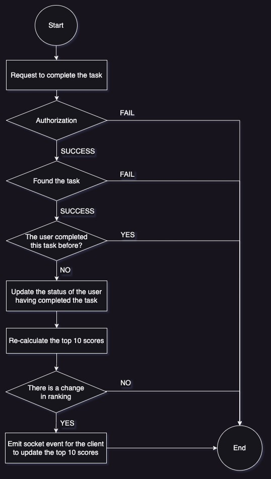

# PhanTanMinh
The code challenge

# Problem 4: Three ways to sum to n
Provide 3 unique implementations of the following function in TypeScript.
- Comment on the complexity or efficiency of each function.

**Input**: `n` - any integer
*Assuming this input will always produce a result lesser than `Number.MAX_SAFE_INTEGER`*.

**Output**: `return` - summation to `n`, i.e. `sum_to_n(5) === 1 + 2 + 3 + 4 + 5 === 15`.

**Advance** This feature does not yet describe the case `n < 1`, so assume that:
- returns -1 for n < 0
- return 0 for n = 0

## See resolved issue [here](./problem4/problem4.ts)
---

# Problem 5: A Crude Server
Develop a backend server with ExpressJS. Build a set of CRUD interface that allow a user to interact with the service using TypeScript

1. `POST /resources` Create a resource.
2. `GET /resources` List resources with basic filters.
3. `GET /resources/{resource_id}` Get details of a resource.
4. `PUT /resources/{resource_id}` Update resource details.
5. `DELETE /resources/{resource_id}` Delete a resource.

## Dependencies
- <b>Node.js</b> Ensure that you have installed Node.js and npm on your machine. You can download and install Node.js from the official website: https://nodejs.org.
- <b>npm</b>
- <b>Docker and Docker Compose</b>: Our project uses Docker and Docker Compose to run PostgreSQL easily and consistently across different environments. You need to install Docker and Docker Compose before running the project. Make sure Docker is configured and running on your machine. You can learn how to install Docker and Docker Compose from the official Docker website: https://docs.docker.com/get-docker/.
- <b>Colima</b>: We use Colima to manage Docker containers easily and flexibly. You can install Colima from their official website: https://colima.sh/.

## Package
- <b>Express and TypeScript</b>: We use ExpressJS and TypeScript to build the backend server. ExpressJS is a web framework for Node.js, while TypeScript is a statically typed superset of JavaScript. You can install Express and TypeScript via npm:
```bash
npm install express typescript @types/node @types/express
```

- <b>PostgreSQL</b>: PostgreSQL is a powerful open-source relational database management system. We use Docker and Docker Compose to run a simple PostgreSQL container for data storage. Configuration related to PostgreSQL is defined in the [docker-compose.yml](./docker-compose.yml) file.

## How to run on local
- colima start
- docker-compose up -d
- npm run start
---

# Problem 6: Architecture
## Overview
The <b>API Service</b> module provides functionality for updating user scores on the backend application server. It handles API requests from the client application to update user scores securely and efficiently.

## Flow of Execution
- <b>Client Application</b> Initiates an action that triggers a score update.
- <b>Dispatch API Call</b> Upon action completion, the client application dispatches an API call to the backend application server.
- <b>Authorization Check</b> The backend application server checks the authorization of the user making the API call to prevent unauthorized score updates.
- <b>Score Update</b> If the user is authorized, the backend application server updates the user's score accordingly.
- <b>Live Scoreboard Update</b> After updating the score, the backend application server triggers a live update of the scoreboard on the website to reflect the latest changes.

## Refer to the flow diagram below


## Swagger API
See swagger details [here](./documents/swagger.yml)

## Improvement
As applications are scaled, additional features are needed to ensure data integrity or prevent breaches, such as:
- Users managements. Manage users (CRUD) using the interface.
- Tasks managements. Manage tasks (CRUD) using the interface.
- Forgot password, change password.
- Encrypt "completed task" requests to prevent malicious users.
- Scalability: Design the API service module to handle a large number of concurrent requests efficiently to support scalability.
